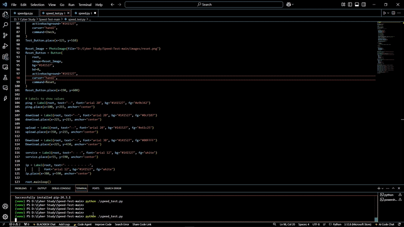

# 📶 Wifi Speed Test

A Python-based application to measure and display your internet speed, providing insights into your current network performance.

## 🖼️ Demo



> *Note: If the GIF doesn't play, [click here to view the video demo](https://github.com/AlyanGulzar/Wifi-Speed-Test-/blob/main/Wifi%20Speed%20Test%20Demo%20Vid.mp4).*

## 🧰 Features

- Measure **download**, **upload**, and **ping** speeds.
- User-friendly interface for easy navigation.
- Real-time speed test results.
- Lightweight and easy to set up.

## 🚀 Getting Started

### Prerequisites

Ensure you have Python installed on your system. You can download it from [python.org](https://www.python.org/downloads/).

### Installation

1. **Clone the repository**:
   ```bash
   git clone https://github.com/AlyanGulzar/Wifi-Speed-Test-.git
   ```

2. **Navigate to the project directory**:
   ```bash
   cd Wifi-Speed-Test-
   ```

3. **Install the required dependencies**:
   ```bash
   pip install -r requirements.txt
   ```

### Running the Application

Execute the following command to start the application:

```bash
python speedtest.py
```

## 📄 Documentation

For a detailed overview of the application's functionality and code structure, refer to the [Wifi Speed Test Documentation.pdf](https://github.com/AlyanGulzar/Wifi-Speed-Test-/blob/main/Wifi%20Speed%20Test%20Documentation.pdf) included in the repository.

## 🛠️ Technologies Used

- Python
- [speedtest-cli](https://github.com/sivel/speedtest-cli)
- Tkinter (for GUI)

## 🤝 Contributing

Contributions are welcome! If you have suggestions for improvements or want to contribute to the project, please fork the repository and submit a pull request.

## 📬 Contact

For any inquiries or feedback, feel free to reach out:

- GitHub: [AlyanGulzar](https://github.com/AlyanGulzar)
- Email: [your-email@example.com](alyangulzar149@gmail.com)

---

*This project is licensed under the MIT License. See the [LICENSE](LICENSE) file for details.*
